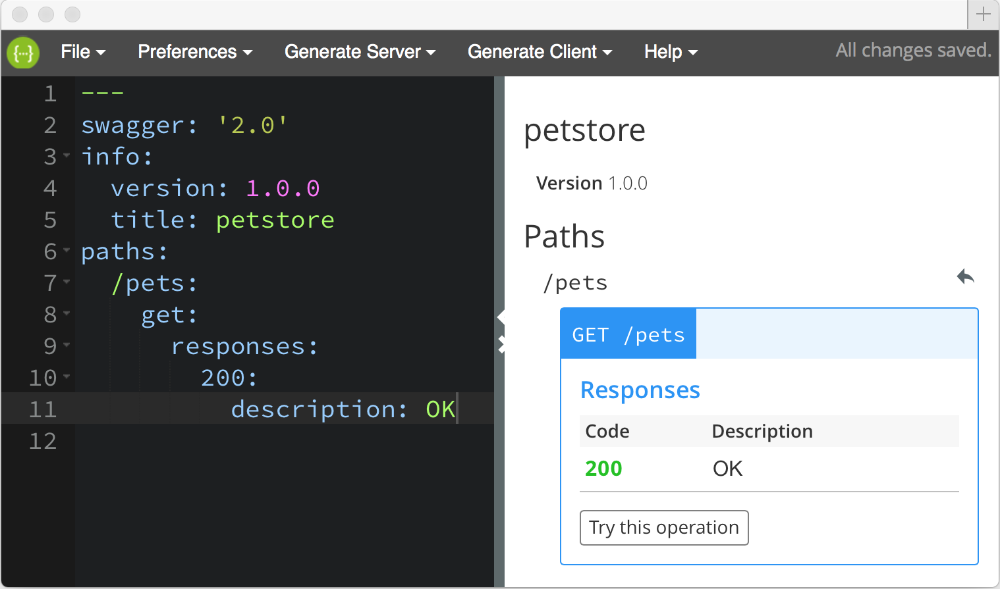

# Swagger Editor

[](https://travis-ci.org/swagger-api/swagger-editor)
[](https://codeclimate.com/github/swagger-api/swagger-editor)

Swagger Editor lets you edit [Swagger API specifications](https://github.com/swagger-api/swagger-spec/blob/master/versions/2.0.md) in YAML inside your browser and to preview documentations in real time.
Valid Swagger JSON descriptions can then be generated and used with the full Swagger tooling (code generation, documentation, etc).

**[LIVE DEMO](http://editor.swagger.io)**

[](http://editor.swagger.io)

#### Running Locally

[**Download the latest release (v2.9.7)**](https://github.com/swagger-api/swagger-editor/releases/download/v2.9.7/swagger-editor.zip) and serve the static files via your HTTP server. If you don't have an HTTP server, you can use [`http-server`](https://www.npmjs.com/package/http-server) Node.js module.

###### Using `http-server` module:
```shell
npm install -g http-server
wget https://github.com/swagger-api/swagger-editor/releases/download/v2.9.7/swagger-editor.zip
unzip swagger-editor.zip
http-server swagger-editor
```

#### Building From Source

Make sure you have [Node.js](http://nodejs.org/) installed. 

```shell
git clone https://github.com/swagger-api/swagger-editor.git
cd swagger-editor
npm start
```

#### Documentations
* [Why "Try this operation" is not working?](docs/cors.md)
* [Importing your Swagger document](./docs/import.md)
* [Development Guide](./docs/development.md)
* [Configuration Guide](./docs/config.md)

[Contributing](./CONTRIBUTING.md)

[LICENSE](./LICENSE)
