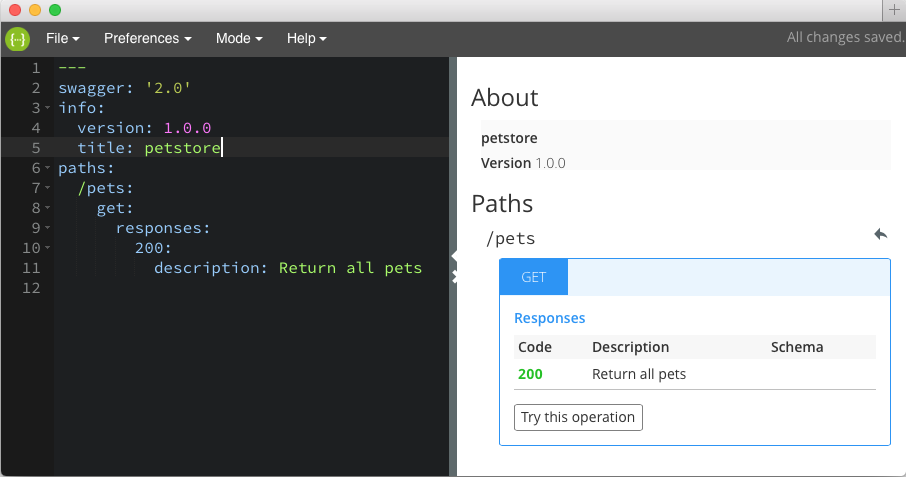

# Swagger Editor

[](https://travis-ci.org/swagger-api/swagger-editor)
[](https://codeclimate.com/github/swagger-api/swagger-editor)

Swagger Editor lets you edit API specifications in YAML inside your browser and to preview documentations in real time.
Valid Swagger JSON descriptions can then be generated and used with the full Swagger tooling (code generation, documentation, etc).

To understand how it works, you should [try the live demo](http://editor.swagger.io/#/edit)!

## YAML Syntax
YAML became a first-class citizen as part of the Swagger 2.0 working group process, however it has not yet been documented in the [Swagger Spec](https://github.com/swagger-api/swagger-spec/blob/master/versions/2.0.md). The editor opens with an example YAML file. For some other examples see '[Creating Swagger JSON from YAML files](https://github.com/swagger-api/swagger-codegen/wiki/Creating-Swagger-JSON-from-YAML-files)'



## Tips
You can import an existing YAML spec by using the `import` query parameter in edit mode. For example:
```
http://editor.swagger.io/#/edit?import=http://generator.wordnik.com/online/api/swagger.yaml
```

## Running Locally

#### Install Node.js

Make sure you have Node.js installed. If you don't have Node.js, install it from it's [Node.js website](http://nodejs.org/).
This project was tested with Node.js version `0.10`. Make sure you have at least this version.

```shell
node --version
```

#### Clone the repository and start it

```shell
git clone git@github.com:swagger-api/swagger-editor.git
cd swagger-editor
```

##### Start on Mac and Linux
```shell
npm start
```

##### Start on Windows
```shell
npm install -g bower grunt-cli
npm install
bower install
grunt serve
```

This will open a browser window running current development version.

## Development

For development it's preferred to have `grunt` installed globally on your machine.  

### Building
To build the project just run: 

```
$ grunt build
```
This will build a new version of the web app, ready for production in `/dist` folder

### Pushing to `gh-page`

To copy everything in `/dist` folder to `gh-pages` branch and push it to github, just run:

```
$ grunt ship
```
Please do not touch `gh-pages` branch manually!

###  Configuration
Swagger Editor will make an XHR GET call to `/config/defaults.json` to get it's settings before launching the app. If you are using Swagger Editor as a dependency, you can provide your own `defaults.json` at this endpoint to override default settings.
See [./docs/config.rst](./docs/config.rst) and [defaults.guide.js](./app/config/defaults.json.guide.js)

#### CORS

If you want to import YAML or JSON resources from other hosts, those resources should
be served as [CORS-enabled resources](http://en.wikipedia.org/wiki/Cross-origin_resource_sharing).

For example, if you get an error such as
```
{"data":"","status":0,"config":{"method":"GET","transformRequest":[null],"transformResponse":
[null],"url":"http://www.example.com/swagger/apis/swagger.json","headers":{"accept":
"application/x-yaml,text/yaml,application/json,*/*"}}}
```
this indicates the resource is not CORS-enabled.
See [./docs/cors.rst](./docs/cors.rst) for how to enable CORS.

### Run with Docker


If you are familiar with [Docker](https://www.docker.com/), a `Dockerfile` is
provided.

Build an image named `swagger-editor`
```
sudo docker build -t swagger-editor .
```

Run the container, using the local port 8080 (you may change this to any available
port).
```
sudo docker run -ti -p 8080:9000 swagger-editor
```
And open [http://localhost:8080](http://localhost:8080) in your browser

### Contributing
File issues in GitHub's to report bugs or issue a pull request.

All contributions must grant copyright permission to this project, the source of which is declared to be under an Apache 2 license (see LICENSE).
