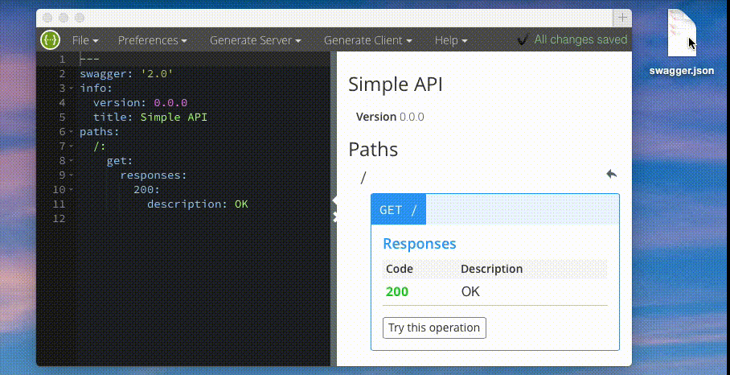

# Importing OpenAPI Specs

Swagger Editor can import your OpenAPI Spec file. OpenAPI Specs can be in JSON or YAML.

### File → Import File

Click **Choose File** and select import. The file you are importing have to be valid JSON or YAML OpenAPI Spec file. Swagger Editor will prompt you about validation errors.

### File → Import URL

Paste in URL to your OpenAPI Spec file. Swagger Editor will use a CORS proxy to download files that are being served with a server that doesn't support XHR calls from other domains. This might not work for locally hosted files, or files that are behind a firewall. Turn the **Use CORS proxy** check-box to disable this feature.

### URL Query Parameter

You can also import an existing YAML or JSON Swagger 2.0 specs document by using the `import` query parameter. 

Note that the query parameter is in fragment section of the URL. After `/#/?`. It's because Swagger Editor is importing the file in the client side.

For example:
```
http://editor.swagger.io/#/?import=http://generator.swagger.io/api/swagger.json
```

Swagger Editor will try to use a CORS proxy server for downloading your YAML. To disable this proxy server pass `no-proxy` query parameter

```
http://editor.swagger.io/#/?import=localhost:8000/swagger.yaml&no-proxy
```

### Drag and Drop

Simply drop your Swagger JSON or YAML files into Swagger Editor browser window. 


